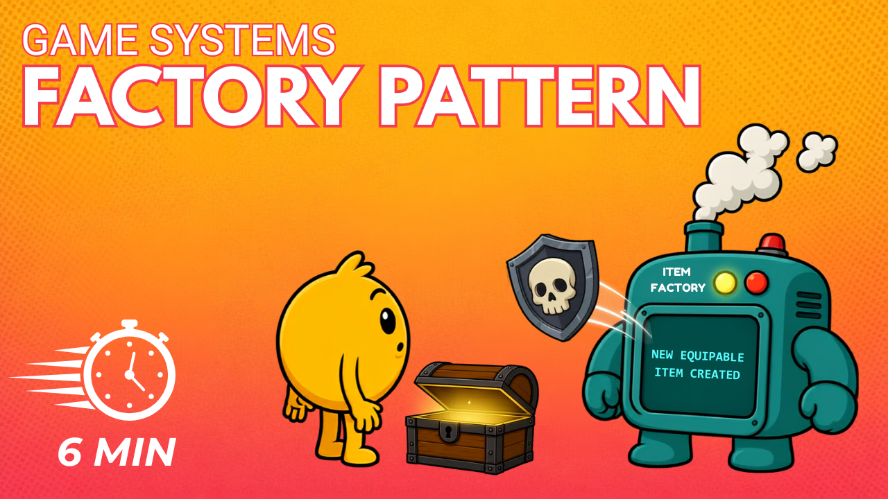

# Convert ScriptableObjects to Runtime Assets

Scriptable Objects are great for storing shared item data but they aren't intended to be modified at runtime. In this tutorial, you'll learn how you can use the factory pattern to convert static data to runtime items that can be stored in the players inventory.

[Watch on YouTube](https://youtu.be/DJwXvOSsas4)
